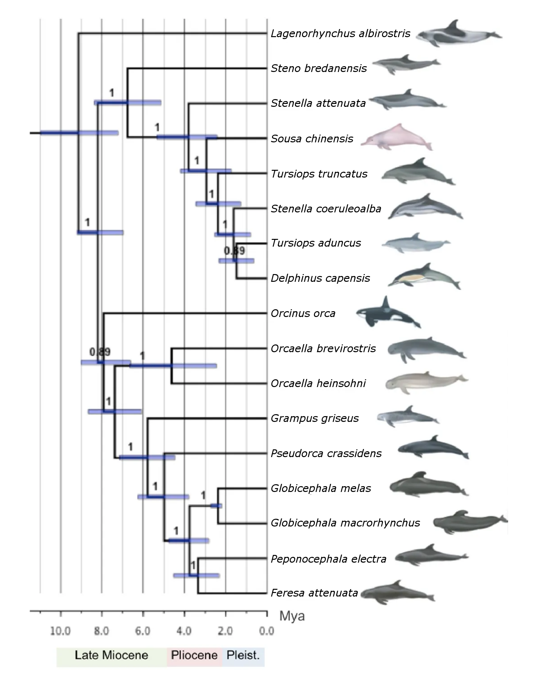
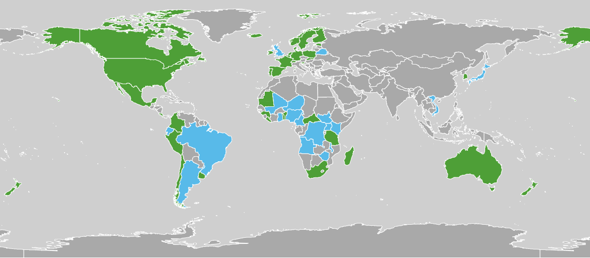

<style>.forceBreak { -webkit-column-break-after: always; break-after: column; }</style>

```{r setup, include=FALSE}
###Rmd setup
knitr::opts_chunk$set(echo = FALSE)
knitr::opts_chunk$set(message = FALSE)
knitr::opts_chunk$set(warning=FALSE)
```

```{r libraries}
###load libraries
library(tidyverse)#base library
library(dismo)#gets animal observation data
library(knitr)#graphic tools for Rmarkdown (allows kable)
library(kableExtra)#extra tools for kable
library(leaflet)#graphic tools for maps
library(rgbif)#search tools for gbif
library(broom)
library(MuMIn)
options("kableExtra.html.bsTable" = T)
load("Data_backup.RData")
```

```{r functions}

names_months <- c(
  "Jan","Feb","Mar","Apr","May","Jun",
  "Jul","Aug","Sep","Oct","Nov","Dec"
)

pal <- colorFactor(
  c(
    "red",
    "blue",
    "pink",
    "yellow",
    "purple",
    "cyan",
    "brown",
    "lightgrey",
    "grey",
    "black",
    "salmon",
    "lightblue",
    "darkred",
    "green",
    "darkgreen",
    "orange",
    "navy"
  ),
  domain = c(
    "Cephalorhynchus",
    "Delphinus",
    "Feresa",
    "Globicephala",
    "Grampus",
    "Lagenodelphis",
    "Lagenorhynchus",
    "Lissodelphis",
    "Orcaella",
    "Orcinus",
    "Peponocephala",
    "Pseudorca",
    "Sotalia",
    "Sousa",
    "Stenella",
    "Steno",
    "Tursiops"
  )
)

#fixes incorrect species data names in the database
Delphinidae_Data$specificEpithet[Delphinidae_Data$specificEpithet == "truncantus"] <- "truncatus"
Delphinidae_Data$scientificName[Delphinidae_Data$scientificName == "Tursiops truncantus Montagu, 1821"] <- "Tursiops truncatus (Montagu, 1821)"

```

## *Delphinidae* {.columns-2 .smaller}
```{r, out.width = "100%", out.height= "100%", fig.cap= "Killer whales photographed off the south side of Unimak Island, eastern Aleutian Islands, Alaska. Photograph by Robert Pitman (NOAA).", echo=FALSE}
knitr::include_graphics(
  "SubjectEvaluation_2R_Slides-figure/Killerwhales_jumping.jpg"
)
```
<p class="forceBreak"></p>
- "Oceanic dolphins"
- Family within superfamily *Delphinoidea* inside infraorder Cetacea
- <span style="color:red">Cetacea:</span>
    + Baleen whales
    + <span style="color:red">Toothed whales</span>
        + *Ziphiidae* (beaked whales)
        + *Platanistidae* (river dolphins)
        + *Kogiidae* (dwarf sperm whales)
        + *Physeteridae* (sperm whales)
        + <span style="color:red">*Delphinoidea*</span>
            + *Phocoenidae* (porpoises)
            + *Monodontidae* (belugas and narwhals)
            + <span style="color:red">*Delphinidae*</span> (dolphins, killer and pilot whales)

## *Delphinidae*: {.columns-2 .smaller}
```{r, out.width = "80%", out.height= "80%", fig.cap= "Phylogenetic tree of selected taxa within Delphinidae, edited from: *Vilstrup et al, 2011*", echo=FALSE}

```
<p class="forceBreak"></p>
- Over 30 extant species
- **Most** live in the oceans
- Larger species are named whales
- Whale watching

## Observation Data - GBIF {.columns-2 .smaller}
```{r, out.width = "100%", out.height= "100%", fig.cap= "GBIF global network since 2019", echo=FALSE}

```
<font size="2"><span style="color:green">Voting participant</span>

<span style="color:cyan">Associate participant</span></font>

<p class="forceBreak"></p>
- Global Biodiversity Information Facility
- **Free**
- **Open access**
-  Biodiversity data **worldwide**

## Observation Data - Diversity {.smaller}
```{r, echo=FALSE}

Delphinidae_Table <- Delphinidae_Data %>% 
  filter(
    !is.na(genus) &
      !is.na(specificEpithet)
  ) %>% 
group_by(genus,specificEpithet) %>%
  summarise(
    occurrences=n()
  ) %>% 
  mutate(
    Genus = cell_spec(
      genus,
      "html",
      color = "white",
      italic = TRUE,
      background = pal(genus)
    )
  ) %>% 
  mutate(
    Species = cell_spec(
      specificEpithet,
      "html",
      color = "black",
      italic = TRUE
    )
  ) %>% 
  mutate(
    Observations = occurrences
  ) %>%
  ungroup() %>% 
  dplyr::select(-genus,-specificEpithet,-occurrences)

rows <- seq_len(nrow(Delphinidae_Table) %/% 2)

kable(
  list(Delphinidae_Table[rows,1:3],  
           matrix(numeric(), nrow=0, ncol=1),
           Delphinidae_Table[-rows, 1:3]),
  format = "html",
  escape = FALSE
) %>%
  kable_styling(
    bootstrap_options = c(
      "striped",
      "hover",
      "condensed",
      "responsive",
      font_size = 1,
      position = "left",
      full_width = FALSE
    )
  )
```
Observation data of members of the Delphinidae family

## Observation Data - Global Diversity {.smaller}
```{r, fig.align="center", fig.width=9, fig.height=4}

Delphinidae_Loc <- Delphinidae_Data %>%
  dplyr::select(
    genericName,
    genus,
    species,
    specificEpithet,
    scientificName,
    year,
    country,
    decimalLongitude, 
    decimalLatitude
  ) %>% 
  filter( #should be mostly redundant
    !is.na(decimalLongitude) &
      !is.na(decimalLatitude) &
      !is.na(genus) &
      !is.na(specificEpithet)
  )

leaflet(data = Delphinidae_Loc) %>%
  addProviderTiles("OpenTopoMap") %>%
  setView(-99, 19, zoom = 4) %>%
  addTiles() %>%
  addCircleMarkers(
    ~decimalLongitude,
    ~decimalLatitude,
    label = ~paste(as.character(genus),as.character(specificEpithet)),
    fillOpacity = 0.6,
    radius = 5,
    color = ~pal(genericName),
    stroke = FALSE,
    #clusterOptions = markerClusterOptions(removeOutsideVisibleBounds = TRUE, zoomToBoundsOnClick = TRUE, showCoverageOnHover = TRUE)
  )
```
Location data of Delphinidae species grouped by genera

## Observation Data - Per Country

```{r, out.width = "90%", out.height= "90%", echo=FALSE}

Delphinidae_Countries <- Delphinidae_Data %>% 
  group_by(country,year) %>%
  summarise(
    Observations=n()
  ) %>%
  rename(
    Country = country,
    Year = year
  ) %>% 
  filter(
    Observations >= 10 &
    !is.na(Country)
  )

ggplot(
  Delphinidae_Countries,
  aes(
    x = Country,
    y = Observations,
    shape = as.factor(Year),
    fill = as.factor(Year)
  )
) +
  geom_point() +
  theme(
    axis.text.x = element_text(angle = 90, hjust = 1)
  ) + 
  labs(
    title = "Delphinidae sightings per country",
    x = "Location",
    y = "Observations",
    fill = "Year",
    shape = "Year"
  ) +
  scale_fill_manual(
    values = c(
      "2019" = "red",
      "2018" = "blue",
      "2017" = "yellow",
      "2016" = "green",
      "2015" = "orange",
      "2014" = "purple",
      "2013" = "lightblue",
      "2012" = "brown",
      "2011" = "grey",
      "2010" = "black"
    )
  ) +
  scale_shape_manual(
    values = c(
      "2019" = 21,
      "2018" = 21,
      "2017" = 21,
      "2016" = 21,
      "2015" = 21,
      "2014" = 21,
      "2013" = 21,
      "2012" = 21,
      "2011" = 21,
      "2010" = 21
    )
  )
```

## Observation Data - *Orcinus orca* {.smaller}
```{r, out.width = "90%", out.height= "90%", echo=FALSE}

Delphinidae_Orca <- Delphinidae_Data %>%
  filter(
    specificEpithet == "orca"
  ) %>% 
  group_by(country,year) %>%
  summarise(
    Observations=n()
  ) %>%
  rename(
    Country = country,
    Year = year
  ) %>% 
  filter(
    !is.na(Country),
    !is.na(Year),
    Observations >= 10,
    Country != "French Southern Territories",
    Year != 2019
  )

ggplot(
  Delphinidae_Orca,
  aes(
    x = as.factor(Year),
    y = Observations,
    shape = Country,
    fill = Country
  )
) +
  geom_point() + 
  theme(
    axis.text.x = element_text(angle = 90, hjust = 1)
  ) + 
  labs(
    title = "Orcinus orca sightings",
    x = "Year",
    y = "Observations",
    shape = "Location",
    fill = "Location"
  ) +
  scale_fill_manual(
    values = c(
      "Canada" = "red",
      "French Southern Territories" = "lightblue",
      "Netherlands" = "brown",
      "Norway" = "yellow",
      "Sweden" = "purple",
      "United Kingdom" = "green",
      "United States of America" = "blue"
    )
  ) +
  scale_shape_manual(
    values = c(
      "Canada" = 21,
      "French Southern Territories" = 21,
      "Netherlands" = 21,
      "Norway" = 21,
      "Sweden" = 21,
      "United Kingdom" = 21,
      "United States of America" = 21
    )
  )
```
<p class="forceBreak"></p>

## Observation Data - When to travel {.smaller}
```{r, echo=FALSE, include= FALSE}
Delphinidae_Orca_2 <- rbind (
  (Delphinidae_Data %>%
     filter(
       specificEpithet == "orca",
       country == "Canada"
     )
   ),
  (Delphinidae_Data %>%
     filter(
       specificEpithet == "orca",
       country == "Netherlands"
     )
   ),
  (Delphinidae_Data %>%
     filter(
       specificEpithet == "orca",
       country == "Norway"
     )
   ),
  (Delphinidae_Data %>%
     filter(
       specificEpithet == "orca",
       country == "Sweden"
     )
   ),
  (Delphinidae_Data %>%
     filter(
       specificEpithet == "orca",
       country == "United Kingdom"
     )
   ),
  (Delphinidae_Data %>%
     filter(
       specificEpithet == "orca",
       country == "United States of America"
     )
   )
) %>% 
  group_by(country,month,year) %>%
  summarise(
    Observations=n()
  ) %>%
  rename(
    Country = country,
    Month = month,
    Year = year
  ) %>% 
  filter(
    !is.na(Country),
    !is.na(Month),
    !is.na(Year),
    Year != 2019
  )

Delphinidae_Orca_2$Month <- names_months[
  Delphinidae_Orca_2$Month
  ]

Fit_A <- glm(Observations ~ Year+Country, data = Delphinidae_Orca_2)
Tidy_A <- tidy(Fit_A)
Sum_A <- glance(Fit_A) %>% 
  mutate(Model="Year*Country")

Fit_B <- glm(Observations ~ Year*Month*Country, data = Delphinidae_Orca_2)
Tidy_B <- tidy(Fit_B)
Sum_B <- glance(Fit_B) %>% 
  mutate(Model="Year + Country")

Fit_C <- glm(Observations ~ Year + Month*Country, data = Delphinidae_Orca_2)
Tidy_C <- tidy(Fit_C)
Sum_C <- glance(Fit_C) %>% 
  mutate(Model="Year:Country")

Fits <- bind_rows(Sum_A,Sum_B,Sum_C) %>% 
  arrange(AIC)
Fit_Selected <- Fits$Model[1]

Delphinidae_Orca_Pred <- expand.grid(
  list(
    Country = c(
      "Canada",
      "Netherlands",
      "Norway",
      "Sweden",
      "United Kingdom",
      "United States of America"
    ),
    Month = c(
      "Jan",
      "Feb",
      "Mar",
      "Apr",
      "May",
      "Jun",
      "Jul",
      "Aug",
      "Sep",
      "Oct",
      "Nov",
      "Dec"
    ),
    Year = as.numeric(
      c(
        "2017",
        "2018",
        "2019",
        "2020",
        "2021",
        "2022"
      )
    )
  )
)

Predictions_Orca <- predict(Fit_B,Delphinidae_Orca_Pred)

TEST <- cbind (Delphinidae_Orca_Pred,Predictions_Orca) %>% 
  rename(
    Predictions = Predictions_Orca
  )

TEST$Predictions[TEST$Predictions < 0] <- 0
```
```{r, out.width = "90%", out.height= "90%", echo=FALSE}
ggplot(
  TEST,
  aes(
    x = Month,
    y = Predictions,
    color = Country
  )
) +
  geom_point() + 
  theme(
    axis.text.x = element_text(angle = 90, hjust = 1)
  ) + 
  facet_wrap(
    ~Year,
    ncol = 2
  ) +
  labs(
    title = "Predicted Orcinus orca sightings",
    x = "Month",
    y = "Predictions",
    color = "Location"
  ) +
  scale_fill_manual(
    values = c(
      "Canada" = "red",
      "Netherlands" = "brown",
      "Norway" = "yellow",
      "Sweden" = "purple",
      "United Kingdom" = "green",
      "United States of America" = "blue"
    )
  )+
  scale_color_manual(
    values = c(
      "Canada" = "red",
      "Netherlands" = "brown",
      "Norway" = "yellow",
      "Sweden" = "purple",
      "United Kingdom" = "green",
      "United States of America" = "blue"
    )
  )
```
<p class="forceBreak"></p>
