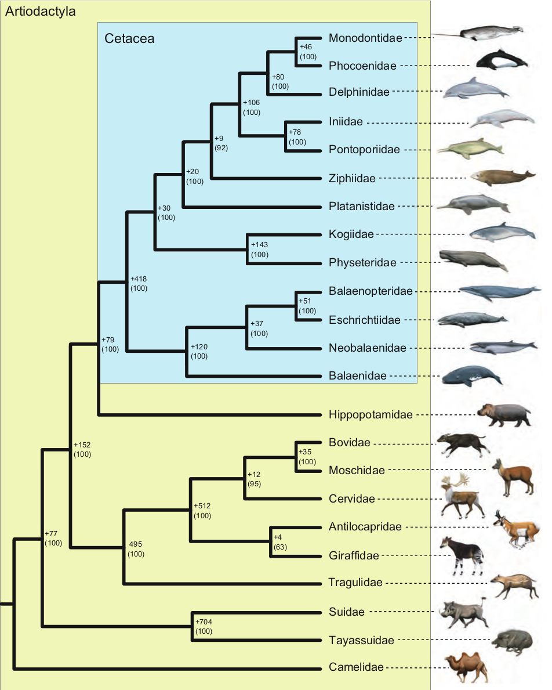

<style>
text-align: justify
</style>

```{r libraries, include=FALSE}
###load libraries
library(tidyverse)#base library
library(dismo)#gets animal observation data
library(knitr)#graphic tools for Rmarkdown (allows kable)
library(kableExtra)#extra tools for kable
library(leaflet)#graphic tools for maps
library(rgbif)#search tools for gbif
library(broom)#for fit data
library(bookdown)#for citations in fig. caption
options("kableExtra.html.bsTable" = T)
load("Data_backup.RData")
```
```{r functions, echo=FALSE}

names_months <- c(
  "Jan","Feb","Mar","Apr","May","Jun",
  "Jul","Aug","Sep","Oct","Nov","Dec"
)

pal <- colorFactor(
  c(
    "red",
    "blue",
    "pink",
    "yellow",
    "purple",
    "cyan",
    "brown",
    "lightgrey",
    "grey",
    "black",
    "salmon",
    "lightblue",
    "darkred",
    "green",
    "darkgreen",
    "orange",
    "navy"
  ),
  domain = c(
    "Cephalorhynchus",
    "Delphinus",
    "Feresa",
    "Globicephala",
    "Grampus",
    "Lagenodelphis",
    "Lagenorhynchus",
    "Lissodelphis",
    "Orcaella",
    "Orcinus",
    "Peponocephala",
    "Pseudorca",
    "Sotalia",
    "Sousa",
    "Stenella",
    "Steno",
    "Tursiops"
  )
)

min <- function(x,n) {
       value = sort(x, FALSE)[n]
       column_name = colnames(x)[which(x == value, arr.ind = TRUE)[2]]
       paste0("Column:",column_name," , Value:",value)
}

#fixes incorrect species data names in the database
Delphinidae_Data$specificEpithet[Delphinidae_Data$specificEpithet == "truncantus"] <- "truncatus"
Delphinidae_Data$scientificName[Delphinidae_Data$scientificName == "Tursiops truncantus Montagu, 1821"] <- "Tursiops truncatus (Montagu, 1821)"

```

# Introduction

Observing cetaceans (whales and dolphins) in their natural habitat, by either observing directly from the coast or going into the open ocean, is a recreational activity that is quickly gaining popularity and becoming a booming touristic industry, in what is known as whale watching @perrin2009encyclopedia.

The practice originated in the United States during the early fifties with the observation of the migratory behavior of grey whales near the Cabrillo National Monument area in San Diego and spread throughout the Pacific coast of the US.
In the Atlantic coast, the Montreal Zoological Society started the practice in the early seventies organizing beluga whale observation trips in the St. Lawrence River. By 1985, whale watching had grown more popular in the Atlantic coast of the US surpassing the number of watchers in the opposing coast of the country. This difference in growth speed of the industry has been attributed to both the local population of humpback whales (_Megaptera novaeangliae_) and the presence of large cities in the region @perrin2009encyclopedia.

In 1992, the Whale and Dolphin Conservation Society (WDCS) carried out the first global whale watching survey, conducted by Erich Hoyt. An updated version was submitted by the United Kingdom to the International Whaling Commission (IWC) during 1995, in a demonstration of the economical-touristic value of cetacean conservation @hoyt2001whale.

Cetaceans themselves are large marine mammals, diverging from even-toed ungulates (Artiodactyla) during the Paleogene, with their closest living land-dwelling being hippos. Cetaceans are split around 34 million years ago into two parvorders @gatesy2013phylogenetic, as shown in figure \ref{fig:tree01}.

Mysticeti, also known as baleen whales, which is comprised of 15 extant species distributed into the families _Balaenidae_ (right and bowhead whales), _Balaenopteridae_ (rorquals), _Cetotheriidae/Neobalaenidae_ (pygmy right whale), and _Eschrichtiidae_ (gray whale). The most notable species within the parvorder is perhaps the blue whale (_Balaenoptera musculus_), which has the honor of being the largest animal known to have ever existed.

The second parvorder of cetaceans is the Odontoceti, toothed whales, comprised of several families grouped into the superfamilies, Delphinoidea (doplhins and relatives), Inioidea, Platanistoidea, Lipotoidea (all river dolphins), Physeteroidea (sperm whales) and Ziphioidea (beaked whales). Within these superfamilies the most notable species are, the sperm whale (_Physeter macrocephalus_), the common bottlenose dolphin (_Tursiops truncatus_) and the orca (_Orcinus orca_), shown in figure \ref{fig:photo_orca}. The popularity of these species is most likely due to the effect of literature and television shows and movies, specially Moby-Dick (a novel by Herman Melville, 1851), Flipper (a MGM television show, 1964) and Free Willy (a Warner Bros. movie, 1993), respectively.

```{r, fig.align="center", out.width = "50%", fig.cap="\\label{fig:tree01} The phylogenetic position of Cetacea relative to other extant artiodactyls. Bootstrap percentages are in parentheses to the right of nodes and below branch support scores. Modified from Gatesy, et al (2012).", echo=FALSE}

```
```{r, fig.align="center", out.width = "80%", fig.cap= "\\label{fig:photo_orca}Killer whales photographed off the south side of Unimak Island, eastern Aleutian Islands, Alaska. Photograph by Robert Pitman (NOAA).", echo=FALSE}
knitr::include_graphics(
  "figures/Killerwhales_jumping.jpg"
)
```

# Methods

Recorded data of human sightings of all described cetacean species in the delphinidae family corresponding to the period of `r year_from` to `r year_to` was recollected from the Blobal Biodiversity Information Facility (GBIF).

This data was analyzed considering the species, genus, location and time of each observation, and used to establish a global map of delphinidae sightings during this last decade, to identify popular locations for whale watching and to make predictions for the immediate future regarding the expected number of sightings for the _Orcinus orca_ species.

# Results
## Delphinidae biodiversity
\FloatBarrier

Human wildlife observations registered at GBIF from the start of `r year_from` to `r as.numeric(curr_Year)`/`r as.numeric(curr_Month)`/`r as.numeric(curr_Day)`, have produced `r dplyr::count(Delphinidae_Data)` observations of members of the _Delphinidae_ family, registering global ocurrence data for `r dplyr::count(summarise(group_by(Delphinidae_Data,speciesKey)))` species, between
`r dplyr::count(summarise(group_by(Delphinidae_Data,genusKey)))` genera (Table \ref{table:species}).

```{r, echo=FALSE, results='asis'}
Delphinidae_Table <- Delphinidae_Data %>% 
  filter(
    !is.na(genus) &
      !is.na(specificEpithet)
  ) %>% 
group_by(genus,specificEpithet) %>%
  summarise(
    occurrences=n()
  ) %>% 
  mutate(
    Genus = cell_spec(
      genus,
      #color = "white",
      italic = TRUE,
      #background = pal(genus)
    )
  ) %>% 
  mutate(
    Species = cell_spec(
      specificEpithet,
      #color = "black",
      italic = TRUE
    )
  ) %>% 
  mutate(
    Obs. = occurrences
  ) %>%
  ungroup() %>% 
  dplyr::select(-genus,-specificEpithet,-occurrences)

rows <- seq_len(nrow(Delphinidae_Table) %/% 2)

kable(
  list(Delphinidae_Table[rows,1:3],  
           matrix(numeric(), nrow=0, ncol=1),
           Delphinidae_Table[-rows, 1:3]),
  escape = FALSE,
  caption = "\\label{table:species} Observation data of members of the Delphinidae family obtained from the Global Biodiversity Information Facility, corresponding to the analysed period, depicting the number of occurrences per species. Species are grouped by genera utilising the same color palette used in all figures"
) %>%
  kable_styling(
    bootstrap_options = c(
      "striped",
      "condensed",
      font_size = 7,
      position = "left",
      pad=0,
      full_width = FALSE
    )
  )
```

## Sightings per country
```{r, fig.align="center", out.width = "100%", fig.cap="\\label{fig:plot_country_obs} Annual observation data during the analyzed period, countries with less than 10 recorded sighting events in a year were excluded.", echo=FALSE}

Delphinidae_Countries <- Delphinidae_Data %>% 
  group_by(country,year) %>%
  summarise(
    Observations=n()
  ) %>%
  rename(
    Country = country,
    Year = year
  ) %>% 
  filter(
    Observations >= 10 &
    !is.na(Country)
  )

ggplot(
  Delphinidae_Countries,
  aes(
    x = Country,
    y = Observations,
    shape = as.factor(Year),
    fill = as.factor(Year)
  )
) +
  geom_point() +
  theme(
    axis.text.x = element_text(angle = 90, hjust = 1)
  ) + 
  labs(
    title = "Delphinidae sightings per country",
    x = "Location",
    y = "Observations",
    fill = "Year",
    shape = "Year"
  ) +
  scale_fill_manual(
    values = c(
      "2019" = "red",
      "2018" = "blue",
      "2017" = "yellow",
      "2016" = "green",
      "2015" = "orange",
      "2014" = "purple",
      "2013" = "lightblue",
      "2012" = "brown",
      "2011" = "grey",
      "2010" = "black"
    )
  ) +
  scale_shape_manual(
    values = c(
      "2019" = 21,
      "2018" = 21,
      "2017" = 21,
      "2016" = 21,
      "2015" = 21,
      "2014" = 21,
      "2013" = 21,
      "2012" = 21,
      "2011" = 21,
      "2010" = 21
    )
  )
```

Utilizing GBIF data, the total _Delphnidae_ sightings during the analized period were extracted and presented in figure \ref{fig:plot_country_obs}. The country with most average sightings per year was the `r Delphinidae_Data %>% group_by(country) %>% summarise(Sightings=n()) %>% filter(Sightings == max(Sightings)) %>%  subset(select = -Sightings)`, averaging `r round((Delphinidae_Data %>% group_by(country) %>% summarise(Sightings=n()) %>% filter(Sightings == max(Sightings)) %>%  subset(select = -country))/(as.numeric(year_to)-as.numeric(year_from)))` yearly sightings.
 `

## Diversity per country
```{r, echo=FALSE, results='asis'}
Delphinidae_Diversity <- Delphinidae_Data %>% 
  group_by(country,genus,specificEpithet) %>%
  summarise(
    Observations=n()
  ) %>%
  rename(
    Country = country,
    Genus = genus,
    Species = specificEpithet
  ) %>% 
  filter(
    Observations >= 10 &
    !is.na(Country) &
    !is.na(Genus) &
    !is.na(Species)
  )

Delphinidae_Country_Div <- Delphinidae_Diversity %>% 
  group_by(Country) %>%
  summarise(
    Biodiversity=n()
  ) %>%
  filter(
    Biodiversity >= 5
  )

rows2 <- seq_len(nrow(Delphinidae_Country_Div) %/% 2)

kable(
  list(Delphinidae_Country_Div[rows2,1:2],  
           matrix(numeric(), nrow=0, ncol=1),
           Delphinidae_Country_Div[-rows2, 1:2]),
  escape = FALSE,
  caption = "\\label{table:country_div} Delphinidae family biodiversity data per country. Table data includes countries with a biodiversity of at least 5 different species."
) %>%
  kable_styling(
    bootstrap_options = c(
      "striped",
      "scale_down",
      font_size = 1,
      position = "left",
      full_width = FALSE
    )
  )
```
Only `r dplyr::count(summarise(group_by(Delphinidae_Diversity,Country)))` countries had stable sightings of _Delphinidae_ species (averaging more than one sighting per species, per year, during the `r year_from`-`r year_to`period), from a total of `r dplyr::count(summarise(group_by(Delphinidae_Data,country)))` analyzed countries.
The country with the highest biodiversity was the `r Delphinidae_Diversity %>% group_by(Country) %>% summarise(Biodiversity=n()) %>% filter(Biodiversity == max(Biodiversity)) %>%  subset(select = -Biodiversity)`, with `r Delphinidae_Diversity %>% group_by(Country) %>% summarise(Biodiversity=n()) %>% filter(Biodiversity == max(Biodiversity)) %>%  subset(select = -Country)` different species sighted during the period.
Only `r dplyr::count(Delphinidae_Diversity %>% group_by(Country) %>% summarise(Biodiversity=n()) %>% filter(Biodiversity >= 5) %>%  subset(select = -Biodiversity))` countries had more than 5 different species observed during the period (Table \ref{table:country_div}). Similarly `r dplyr::count(Delphinidae_Diversity %>% group_by(Country) %>% summarise(Biodiversity=n()) %>% filter(Biodiversity == 1) %>%  subset(select = -Biodiversity))` countries had minimal biodiversity, at only 1 species with stable sightings.

## Orcinus orca sightings per country
```{r, out.width = "100%", fig.cap="\\label{fig:orca_country} Yearly orca sightings from 2010 to 2018, in the countries with most stable sightings.", echo=FALSE}

#Fun fact using italics, like "_Orcinus orca_" in a caption makes the caption go wrong.

Delphinidae_Orca_Sightings <- Delphinidae_Data %>% 
  filter(
       specificEpithet == "orca"
     ) %>% 
  group_by(country) %>%
  summarise(
    Ocurrences=n()
  )

Delphinidae_Orca <- rbind (
  #(Delphinidae_Data %>%
  #   filter(
  #     specificEpithet == "orca",
  #     country == "French Southern Territories"
  #   )
  # ), #removed due to too much missing data
  (Delphinidae_Data %>%
     filter(
       specificEpithet == "orca",
       country == "Norway"
     )
   ),
  (Delphinidae_Data %>%
     filter(
       specificEpithet == "orca",
       country == "United States of America"
     )
   ),
  (Delphinidae_Data %>%
     filter(
       specificEpithet == "orca",
       country == "Canada"
     )
   ),
  (Delphinidae_Data %>%
     filter(
       specificEpithet == "orca",
       country == "United Kingdom"
     )
   ),
  (Delphinidae_Data %>%
     filter(
       specificEpithet == "orca",
       country == "Denmark"
     )
   )
) %>% 
  group_by(country,month,year) %>%
  summarise(
    Observations=n()
  ) %>%
  rename(
    Country = country,
    Month = month,
    Year = year
  ) %>% 
  filter(
    !is.na(Country),
    !is.na(Month),
    !is.na(Year),
    Year != 2019
  )

Delphinidae_Orca$Month <- names_months[
  Delphinidae_Orca$Month
  ]

Delphinidae_Orca$Month = factor(Delphinidae_Orca$Month, levels = month.abb)
#recognized error, months were not prorperly ordered, and seems that the model was using the position of the months rather then the actual month

ggplot(
  Delphinidae_Orca,
  aes(
    x = Month,
    y = Observations,
    color = Country
  )
) +
  geom_point() + 
  theme(
    axis.text.x = element_text(angle = 90, hjust = 1)
  ) + 
  facet_wrap(
    ~Year,
    ncol = 2
  ) +
  labs(
    title = "Recorded Orcinus orca sightings",
    x = "Month",
    y = "Sightigs",
    color = "Location"
  ) +
  scale_fill_manual(
    values = c(
      "Canada" = "red",
      "Denmark" = "brown",
      "Norway" = "yellow",
      "French Southern Territories" = "purple",
      "United Kingdom" = "green",
      "United States of America" = "blue"
    )
  )+
  scale_color_manual(
    values = c(
      "Canada" = "red",
      "Denmark" = "brown",
      "Norway" = "yellow",
      "French Southern Territories" = "purple",
      "United Kingdom" = "green",
      "United States of America" = "blue"
    )
  )
```
Of the recorded species, perhaps none has had such a dramatic shift in public perception as _Orcinus orca_, initially considered dangerous savage animals and even pests, whose populations were often actively killed by both fishermen and governments due to their impact in fishing and whaling activities. Even their name points to a sinister origin, considering its common name of killer whale, and that _orcinus_ from latin meaning, belonging to Orcus, the roman god of the netherworld. 
Society's opinion on the animals began to change during the late sixties, with the live capture of Moby Doll, and Bigg's researching their complex social structures and the actual numbers of their heavily reduced populations due to extensive "hunting".
Unlike the most common popular species, like _Tursiops truncatus_, with 
`r round (dplyr::count(Delphinidae_Data %>% filter (specificEpithet == "truncatus"))/(as.numeric(year_to)-as.numeric(year_from)))` yearly sightings, orcas only average `r round (dplyr::count(Delphinidae_Data %>% filter (specificEpithet == "orca"))/(as.numeric(year_to)-as.numeric(year_from)))` sightings.
Countries with the highest stable sighting data for _Orcinus orca_ have had their yearly recordings analyzed in figure \ref{fig:orca_country}.

## Expected sightings in the near future
```{r, echo=FALSE, warning= FALSE, results='asis'}

Fit_A <- glm(Observations ~ Year*Country, data = Delphinidae_Orca)
Tidy_A <- tidy(Fit_A)
Sum_A <- glance(Fit_A) %>% 
  mutate(Model="Year*Country")

Fit_B <- glm(Observations ~ Year*Month*Country, data = Delphinidae_Orca)
Tidy_B <- tidy(Fit_B)
Sum_B <- glance(Fit_B) %>% 
  mutate(Model="Year*Month*Country")

Fit_C <- glm(Observations ~ Year + Month*Country, data = Delphinidae_Orca)
Tidy_C <- tidy(Fit_C)
Sum_C <- glance(Fit_C) %>% 
  mutate(Model="Year+Month*Country")

Fits <- bind_rows(Sum_A,Sum_B,Sum_C) %>% 
  arrange(AIC)
Fit_Selected <- Fits$Model[1]

Fits_2 <- Fits %>% dplyr::select(
  Model,
  AIC,
  BIC  
)

kable(
  Fits_2,
  escape = FALSE,
  caption = "\\label{table:model_fits} Tested predictive models using the data corresponding to the most diverse locations with the highest number of stable observations across the decade."
) %>%
  kable_styling(
    bootstrap_options = c(
      "striped",
      "scale_down",
      font_size = 1,
      full_width = FALSE
    )
  )
```

```{r out.width = "100%", warning= FALSE, fig.cap="\\label{fig:plot_model_pred} Predicted orca sightings for the period of 2017 to 2022, for the analyzed countries.", echo=FALSE}
Delphinidae_Orca_Pred <- expand.grid(
  list(
    Country = c(
      "Canada",
      "Denmark",
      "Norway",
      "United Kingdom",
      "United States of America"
    ),
    Month = c(
      "Jan",
      "Feb",
      "Mar",
      "Apr",
      "May",
      "Jun",
      "Jul",
      "Aug",
      "Sep",
      "Oct",
      "Nov",
      "Dec"
    ),
    Year = as.numeric(
      c(
        "2017",
        "2018",
        "2019",
        "2020",
        "2021",
        "2022"
      )
    )
  )
)

Predictions_Orca <- predict(Fit_B,Delphinidae_Orca_Pred)

TEST <- cbind (Delphinidae_Orca_Pred,Predictions_Orca) %>% 
  rename(
    Predictions = Predictions_Orca
  )

TEST$Predictions[TEST$Predictions < 0] <- 0

ggplot(
  TEST,
  aes(
    x = Month,
    y = Predictions,
    color = Country
  )
) +
  geom_point() + 
  theme(
    axis.text.x = element_text(angle = 90, hjust = 1)
  ) + 
  facet_wrap(
    ~Year,
    ncol = 2
  ) +
  labs(
    title = "Predicted Orcinus orca sightings",
    x = "Month",
    y = "Predictions",
    color = "Location"
  ) +
  scale_fill_manual(
    values = c(
      "Canada" = "red",
      "Denmark" = "brown",
      "Norway" = "yellow",
      "French Southern Territories" = "purple",
      "United Kingdom" = "green",
      "United States of America" = "blue"
    )
  )+
  scale_color_manual(
    values = c(
      "Canada" = "red",
      "Denmark" = "brown",
      "Norway" = "yellow",
      "French Southern Territories" = "purple",
      "United Kingdom" = "green",
      "United States of America" = "blue"
    )
  )
```
Using yearly sighting data obtained during this decade 3 predictive models were constructed (Table \ref{table:model_fits}). Utilizing the best fitted model predictions were made for the last 3 years and until 2022, regarding the expected orca sightings, per month for each of the countries considered for the model (Figure \ref{fig:plot_model_pred}).

\FloatBarrier

# Discussion

It is interesting to note that, as shown in fig.\ref{fig:plot_model_pred}, most sightings tend to occur during the summer months, so perhaps the quantity of recorded sightings, on a specific month, might not be representative of the migratory behaviour of these animals, and instead be dependant on the number of people capable of taking such recordings and submitting them, a number that would be expected to increase during summer vacations, explaining the results.

Additionally, it is important to mention an outlier that had to be excluded from the model, despite having some of the largest amount records, `r dplyr::count(Delphinidae_Data %>% filter(specificEpithet == "orca",country == "French Southern Territories"))` to be exact recorded during the `r year_from` to `r year_to` period, however `r dplyr::count(Delphinidae_Data %>% filter(specificEpithet == "orca",country == "French Southern Territories", year <= 2013))` observations up to 2013, only averaging `r round (dplyr::count(Delphinidae_Data %>% filter(specificEpithet == "orca",country == "French Southern Territories", year > 2013))/7,1)` sightings per year during the rest of the period, the reasons for this sudden dissapearence of the species from the French Southern Territories is not apparent, and would require further research to better understand it.

Finally, according to predicted data, the best month to observe orcas in the wild is July, and the best location would be in the US, specifically in Alaska.

# References {#references .unnumbered}